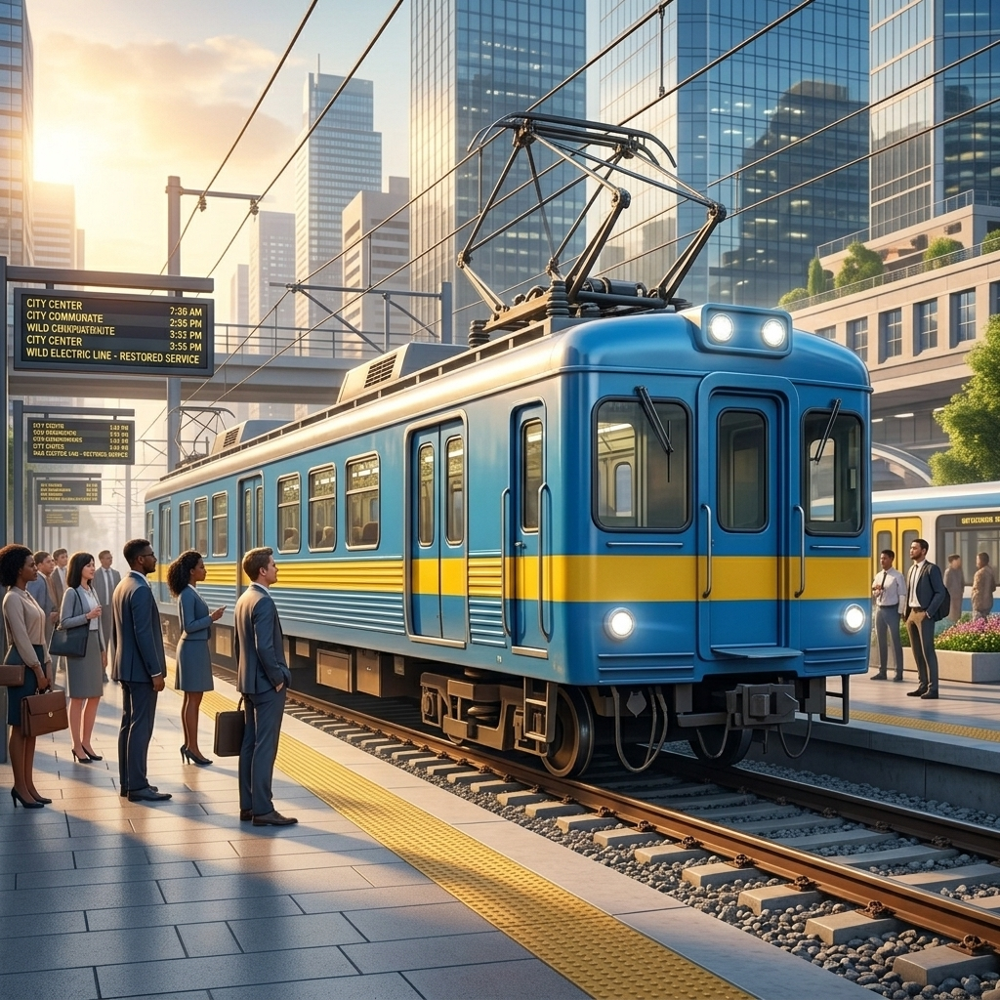
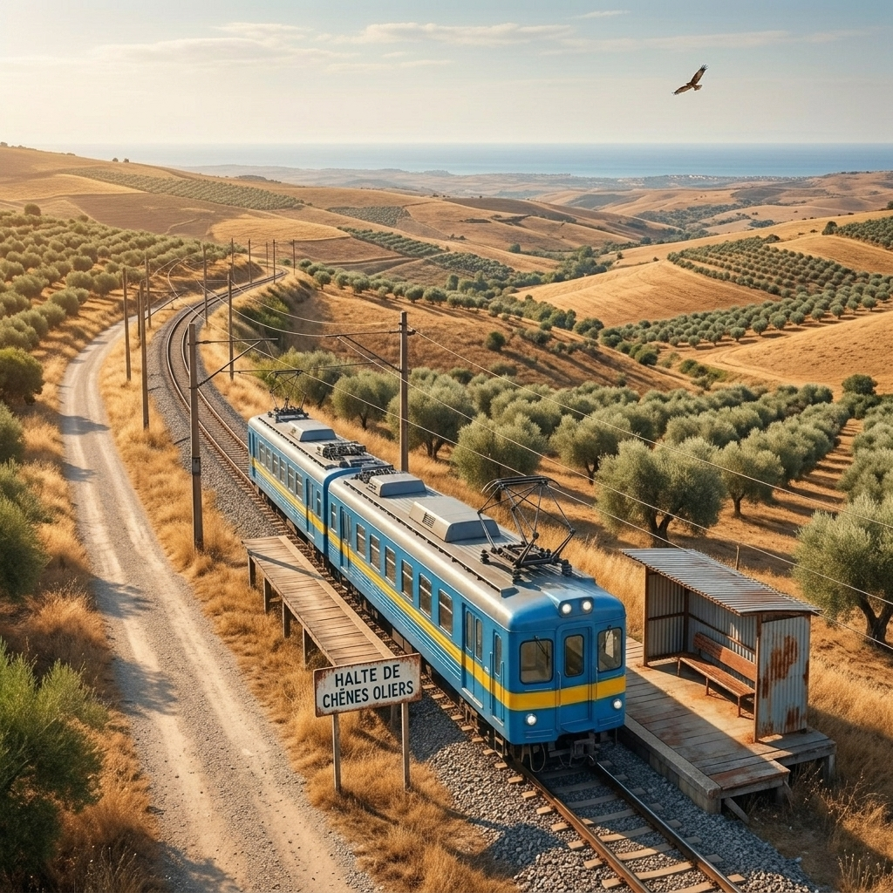

# Легенда о Дикой Электричке

Вот все артефакты, которые мы сгенерировали, и сюжет, объединяющий эти концепты в одну историю.

## Сюжет: Путь Необузданной Стали

В мире, где природа и забытые технологии сплелись воедино, существует **Дикая Электричка**. Это не просто машина, а живой механизм, который сам прокладывает себе путь сквозь заросшие леса и горы, питаясь остаточной энергией старых магистралей. 

Люди верят, что она появляется только перед теми, кто сбился с пути, предлагая билет в один конец до станций, которых нет ни на одной современной карте. Ее маршрут — это загадка, а расписание подчиняется только ей самой.

### Станции Маршрута

````carousel

<!-- slide -->

<!-- slide -->

````

#### Станция 1: "Ржавое Депо" (Исток)
Место, где старые вагоны обретают новую жизнь. Здесь Дикая Электричка начала свой путь, обросшая мхом, лозами и дикой энергией. Именно отсюда она вырывается на просторы, оставляя за собой лишь искры на заржавевших проводах.



#### Станция 2: "Горный Виадук"
Самый опасный участок маршрута. Огромный каменный мост, возвышающийся над пропастью. Местные жители часто приходят сюда на закате, чтобы услышать гудок Дикой Электрички, разносящийся эхом по ущелью.


#### Станция 3: "Станция на Склоне" (Hillside Outpost)
Забытая станция, врезанная прямо в крутой холм. Здесь Электричка делает единственную долгую остановку, позволяя загадочным пассажирам сойти в густой туманный лес. 



#### Станция 4: "Приморский Терминал" (Конечная)
Путешествие заканчивается у самого океана. Здесь рельсы обрываются, уходя в песок. Говорят, что достигнув этой станции, Дикая Электричка замирает и сливается с пейзажем, пока прилив не принесет новую энергию для обратного пути.


---
*Остальные артефакты-свидетели (Трамвай, Дикий Банан, Огурец и новые концепты) тоже надежно сохранены в архиве этой сессии.*
